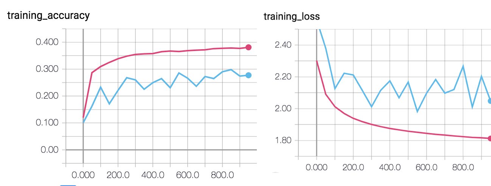

<style>
div.slide {
	background-image:url("./images/wasp.png") !important;
    background-repeat: no-repeat;
    background-position: bottom 5% center;
}
</style>
# Neural networks - applied basics with TensorFlow

Timotheus Kampik

*You find the code and **detailed documentation** [here on GitHub](https://github.com/TimKam/nn-with-tf).*

---
# TensorFlow basics

## Basic TensorFlow operations

```python
x = tensorflow.constant(2, name='x')
y = tensorflow.constant(3, name='y')

operation_1 = tensorflow.add(x, y)
operation_2 = tensorflow.multiply(x, y)
operation_3 = tensorflow.pow(operation_1, operation_2)
```

<!-- footer: Neural networks - applied basics -->
<!-- page_number: true -->

---
## Result and graph

$(2 + 3)^{(2 * 3)} = 5^6 = 15625$


---
# One-layered neural network

When the learning rate is too high (1)...
1) ...the training accuracy does not improve continuously.


---
When the learning rate is too high (1)...
2) ...the loss function does not converge.


---
When the learning rate is too low (0.00001)...
1) ...the training accuracy increases too slowly.
*Note: comparison: learing rate 0.1*


---
When the learning rate is too low (0.00001)...
2) ...the loss function converges too slowly.
*Note: comparison: learing rate 0.1*


---
* When the batch size is too low (10), the resulting model is not accurate.
* When the batch size is too high (2000), the resulting model takes longer to train.



---
batch size: 500,learning rate of 0.05, iterations: 10000 iterations:
-> accuracy: ~42% (more iterations do not seem to help):


---
# Add a hidden layer

```python
    input_dim = 32 * 32 * 3  # d
    x_input = tf.placeholder(tf.float32, shape=[None,
    input_dim])
    y_ = tf.placeholder(tf.float32, shape=[None, 10])
    # Define the parameters of the network
    W = tf.Variable(tf.truncated_normal([input_dim, 10], stddev=.01))
    b = tf.Variable(tf.constant(0.1, shape=[10]))
    # Define the sequence of operations in the network
    # to produce the output
    # y0 = W *  x_input + b
    y0 = tf.matmul(x_input, W) + b
    # hidden layer
    x1 = tf.nn.relu(y0)
    W2 = tf.Variable(tf.truncated_normal([10, 10],
    stddev=.01))
    b2 = tf.Variable(tf.constant(0.1, shape=[10]))
    y = tf.nn.softmax(tf.matmul(x1, W2) + b2) # softmax
```
---
batch size: 500,learning rate of 0.05, iterations: 50000 iterations:
-> accuracy: ~48%:


---
# Add a convolutional layer & run on Floyd Hub
* See [code example on GitHub](https://github.com/TimKam/nn-with-tf)
* Data: https://www.floydhub.com/timkam/datasets/cifar/2
* Job: https://www.floydhub.com/timkam/projects/nn-with-tf/5
* Network not sufficiently optimized (accuracy ~58%)

```python
from network_2 import *
data_dir = '/my_data/'
run_network_2(data_dir, 200, 10000, 0.01)
```

```
floyd run --cpu --env tensorflow-1.3
--data /timkam/datasets/cifar/2:my_data
"python src/floydhub.py"
```

---
# Acknowledgements

This work was partially supported by the Wallenberg Artificial Intelligence, Autonomous Systems and Software Program (WASP) funded by the Knut and Alice Wallenberg Foundation.